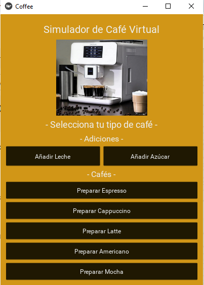
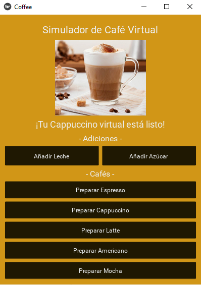

# ☕ Simulador de Cafetería

Una aplicación interactiva desarrollada en Python con Kivy que simula una cafetería completa con interfaz visual moderna y efectos de sonido.

## 🎯 Características

- **5 tipos de café:** Espresso, Cappuccino, Latte, Americano, Mocha
- **Interfaz gráfica moderna** con Kivy
- **Personalización en tiempo real** (leche, azúcar)
- **Efectos de sonido** integrados
- **Imágenes visuales** para cada tipo de café
- **Temporizadores simulados** de preparación
- **Interfaz responsive** y atractiva

## 🛠️ Tecnologías Utilizadas

- Python 3.x
- Kivy (Framework para interfaces multi-touch)
- Kivy SoundLoader para efectos de audio
- PIL (Pillow) para procesamiento de imágenes

## 📦 Instalación y Ejecución

1. **Clona el repositorio:**
```bash
git clone https://github.com/mcamilaChinchilla/simulador-cafeteria.git
cd simulador-cafeteria
```
2. **Instala las dependencias:**
```bash
pip install -r requirements.txt
```

4. **Ejecuta la aplicación:**
```bash
python main.py
```

## 🎮 Cómo Usar

- Selecciona tu café favorito de los 5 tipos disponibles
- Personaliza añadiendo leche o azúcar según tu preferencia
- Observa el proceso de preparación con imágenes y sonidos
- Disfruta de tu bebida virtual preparada a tu gusto

## 📸 Capturas de Pantalla



